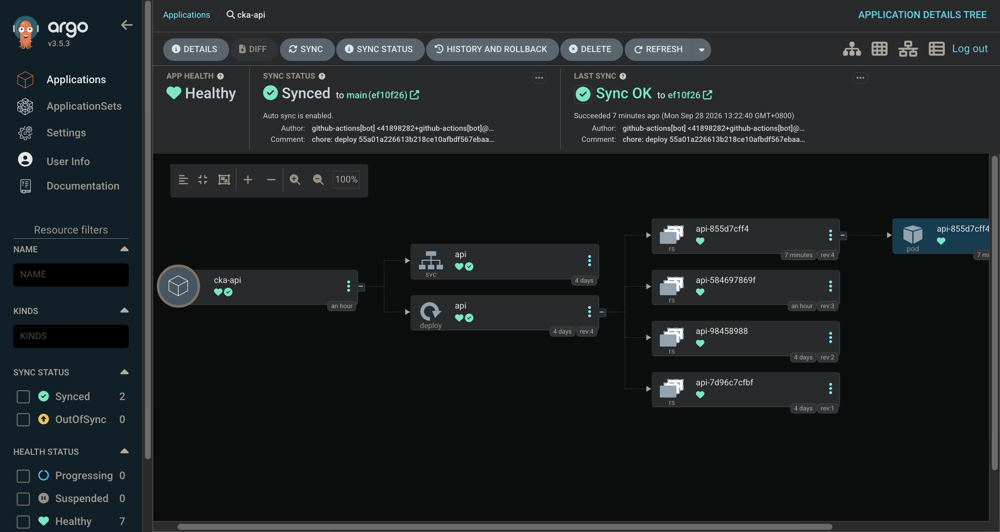

# Kubernetes 30 Days Lab

> A hands-on Kubernetes learning repository that starts from local workloads and gradually connects containerization, networking, storage, scheduling, security, GitOps, CI/CD, and troubleshooting into one end-to-end workflow.



---

## Overview

This repository is the working lab behind a 30-day Kubernetes learning journey.

Instead of learning Kubernetes only from isolated YAML examples, the project gradually builds a small application platform around a FastAPI service, Redis, PostgreSQL, Docker, kind, and Kubernetes. Later stages introduce networking, persistent storage, scheduling, autoscaling, RBAC, Helm, Kustomize, Gateway API, CRDs, Operators, etcd, GitHub Actions, GHCR, and Argo CD.

The final goal is to connect the individual concepts into a complete development flow:

```text
Developer
   |
   | git push
   v
GitHub
   |
   v
GitHub Actions
   |
   | Build multi-architecture image
   | Push image to GHCR
   v
Kustomize image tag updated in Git
   |
   v
Argo CD
   |
   | Compare Desired State vs Actual State
   | Sync
   v
kind Kubernetes Cluster
   |
   v
New application version
```

This repository is intentionally a **learning lab**, not a one-command production template. Many files represent experiments from different days, so they are designed to be read, modified, broken, and repaired.

---

## What You Will Learn

The repository covers the core Kubernetes concepts used throughout the series, including:

- Pods, Deployments, ReplicaSets, and Services
- ConfigMaps and Secrets
- Liveness and readiness probes
- PersistentVolumeClaims and StatefulSets
- Scheduling, labels, node selectors, affinity, taints, and tolerations
- Horizontal Pod Autoscaling
- Jobs, CronJobs, and DaemonSets
- Calico and NetworkPolicy
- RBAC
- Helm and Kustomize
- Ingress, Gateway API, and HTTPRoute
- CRDs and Operators
- kubelet, containerd, Static Pods, and etcd
- GitHub Actions and GHCR
- Argo CD and GitOps
- Kubernetes troubleshooting

---

## Application

The demo application is a small FastAPI service connected to Redis.

The main endpoints are:

```text
GET /
```

Returns a message and increments a Redis-backed visit counter.

```text
GET /health/live
```

A simple liveness endpoint.

```text
GET /work
```

Performs a short CPU-bound loop that can be used for load-generation and HPA experiments.

Example response:

```json
{
  "message": "Hello from GitOps!",
  "visits": 1
}
```

---

## Repository Structure

The repository contains both reusable manifests and files created for specific Kubernetes experiments.

```text
k8s-30days/
├── app/
│   ├── Dockerfile
│   ├── main.py
│   └── requirements.txt
│
├── k8s/
│   ├── 00-namespace.yaml
│   ├── 01-api.yaml
│   ├── 02-configmap.yaml
│   ├── 03-secret.yaml
│   ├── 04-redis.yaml
│   ├── 05-postgres-pvc.yaml
│   ├── 06-postgres.yaml
│   ├── default-deny-ingress.yaml
│   └── redis-networkpolicy.yaml
│
├── deploy/
│   ├── base/
│   │   ├── api.yaml
│   │   └── kustomization.yaml
│   └── overlays/
│       ├── local/
│       │   └── kustomization.yaml
│       └── production/
│           └── kustomization.yaml
│
├── cka-api/
│   └── Helm chart
│
├── argocd/
│   └── cka-api-app.yaml
│
├── .github/
│   └── workflows/
│       └── build.yaml
│
├── api-ingress.yaml
├── gateway.yaml
├── httproute.yaml
├── database-crd.yaml
├── my-database.yaml
├── node-agent.yaml
├── pod-reader-role.yaml
├── reader-binding.yaml
├── report-cronjob.yaml
└── kind-config.yaml
```

Some paths may evolve as the exercises are refined.

---

## Local Cluster Architecture

The kind configuration creates a small multi-node Kubernetes cluster:

```text
                 +----------------------+
                 |    control-plane     |
                 +----------+-----------+
                            |
              +-------------+-------------+
              |                           |
              v                           v
      +---------------+           +---------------+
      |    worker     |           |   worker2     |
      +---------------+           +---------------+
```

The cluster is configured with the default CNI disabled so that a CNI implementation such as Calico can be installed manually as part of the networking exercises.

---

## Prerequisites

Before starting, install:

```text
Docker
kubectl
kind
Git
```

Optional tools used in later labs include:

```text
Helm
Argo CD
```

You also need a GitHub account if you want to reproduce the CI/CD and GitOps sections.

---

## Getting Started

Clone the repository:

```bash
git clone https://github.com/YIFUNLIN/k8s-30days.git
cd k8s-30days
```

Create the kind cluster:

```bash
kind create cluster \
  --name cka-lab \
  --config kind-config.yaml
```

Check the nodes:

```bash
kubectl get nodes
```

Because this cluster disables the default CNI, install a CNI such as Calico before expecting normal Pod networking and fully Ready nodes.

The API Deployment also uses:

```yaml
nodeSelector:
  disktype: ssd
```

Label the worker nodes before deploying that workload:

```bash
kubectl label node cka-lab-worker disktype=ssd
kubectl label node cka-lab-worker2 disktype=ssd
```

---

## Basic Kubernetes Resources

The `k8s/` directory contains the manifests used throughout the earlier labs.

A typical starting point is:

```bash
kubectl apply -f k8s/00-namespace.yaml
kubectl apply -f k8s/02-configmap.yaml
kubectl apply -f k8s/03-secret.yaml
kubectl apply -f k8s/04-redis.yaml
kubectl apply -f k8s/05-postgres-pvc.yaml
kubectl apply -f k8s/06-postgres.yaml
```

Then inspect the environment:

```bash
kubectl get all -n cka-lab
```

These manifests are intentionally kept separate so each Kubernetes resource can be studied independently.

---

## Kustomize

The `deploy/` directory demonstrates a Base + Overlay structure.

```text
deploy/base
        |
        v
deploy/overlays/local
deploy/overlays/production
```

The base contains the reusable API Deployment and Service. The local overlay can override settings such as replica count and image version without duplicating the entire Deployment manifest.

Preview the rendered configuration:

```bash
kubectl kustomize deploy/overlays/local
```

Apply it manually:

```bash
kubectl apply -k deploy/overlays/local
```

In the final GitOps lab, Argo CD performs this synchronization instead of relying on a manual `kubectl apply`.

---

## CI/CD with GitHub Actions and GHCR

The final workflow builds the API container image with GitHub Actions and publishes it to GitHub Container Registry.

The image follows this pattern:

```text
ghcr.io/yifunlin/cka-api:<Git-SHA>
```

Using the Git commit SHA as the image tag provides traceability between:

```text
Running Container
        |
        v
Container Image
        |
        v
Git SHA
        |
        v
Source Code
```

The workflow builds for both:

```text
linux/amd64
linux/arm64
```

This is useful when the GitHub-hosted runner and the local Apple Silicon kind cluster use different CPU architectures.

After publishing a new image, the workflow updates the Kustomize `newTag` and commits that Desired State change back to Git.

---

## GitOps with Argo CD

Argo CD runs inside the Kubernetes cluster and continuously compares:

```text
Git Desired State
       vs
Cluster Actual State
```

The Argo CD Application points to:

```text
Repository:
https://github.com/YIFUNLIN/k8s-30days.git

Branch:
main

Path:
deploy/overlays/local

Destination:
current Kubernetes cluster

Namespace:
cka-lab
```

Create the Argo CD Application:

```bash
kubectl apply -f argocd/cka-api-app.yaml
```

Check it:

```bash
kubectl get applications -n argocd
```

A healthy GitOps state should eventually show:

```text
Synced
Healthy
```

---

## Access the Argo CD Web UI

Forward the Argo CD server to your local machine:

```bash
kubectl port-forward \
  svc/argocd-server \
  -n argocd \
  8080:443
```

Open:

```text
https://localhost:8080
```

The default username is:

```text
admin
```

If the initial admin password has not been changed, retrieve it with:

```bash
kubectl -n argocd \
  get secret argocd-initial-admin-secret \
  -o jsonpath="{.data.password}" \
  | base64 -d

echo
```

Do not publish the password, tokens, kubeconfig contents, decoded Kubernetes Secrets, or registry credentials in screenshots or documentation.

---

## End-to-End GitOps Flow

Once the CI/CD and Argo CD configuration are connected, application deployment becomes:

```text
Edit app/main.py
      |
      v
git commit
      |
      v
git push
      |
      v
GitHub Actions
      |
      +--> Build multi-arch image
      |
      +--> Push to GHCR
      |
      +--> Update Kustomize newTag
      |
      +--> Commit Desired State to Git
      |
      v
Argo CD detects Git change
      |
      v
Argo CD Sync
      |
      v
Kubernetes Rolling Update
      |
      v
New Pod
```

At this point, there is no need to manually run:

```text
docker build
kind load
kubectl apply Deployment
```

for each application update.

---

## Verify the Deployment

Watch the Pods during an update:

```bash
kubectl get pods -n cka-lab -w
```

Check the rollout:

```bash
kubectl rollout status \
  deployment/api \
  -n cka-lab
```

Check the exact image running in the Deployment:

```bash
kubectl get deployment api \
  -n cka-lab \
  -o jsonpath='{.spec.template.spec.containers[0].image}{"\n"}'
```

Forward the API Service:

```bash
kubectl port-forward \
  svc/api \
  -n cka-lab \
  8000:80
```

Then test it:

```bash
curl http://127.0.0.1:8000/
```

Expected response:

```json
{
  "message": "Hello from GitOps!",
  "visits": 1
}
```

---

## Troubleshooting Mindset

One of the main goals of this repository is to practice diagnosing Kubernetes problems by layer instead of guessing.

A useful mental model is:

```text
Pod Pending
    |
    v
Scheduling / Resources / Affinity / Taints / PVC

ImagePullBackOff
    |
    v
Image / Tag / Registry / Credentials / Architecture

CrashLoopBackOff
    |
    v
Logs / Command / Environment / Dependencies / Probes

Pod Running but Service unavailable
    |
    v
Service / Selector / EndpointSlice / Ports / NetworkPolicy

Node NotReady
    |
    v
kubelet / container runtime / CNI / disk / memory

kubectl cannot reach the cluster
    |
    v
Control Plane / Static Pods / API Server / etcd
```

The key workflow is:

```text
Observe
   |
   v
Identify the failure domain
   |
   v
Collect evidence
   |
   v
Fix the root cause
   |
   v
Verify
```

Useful commands include:

```bash
kubectl get pods -A
kubectl describe pod <pod-name> -n <namespace>
kubectl logs <pod-name> -n <namespace>
kubectl logs <pod-name> -n <namespace> --previous
kubectl get events -A --sort-by=.lastTimestamp
kubectl get endpointslices -n <namespace>
kubectl auth can-i <verb> <resource>
kubectl describe node <node-name>
```

---

## Core Idea

The most important idea repeated throughout the project is:

```text
Desired State
     vs
Actual State
```

Kubernetes controllers, Operators, and Argo CD all follow the same general pattern:

```text
Declare
   |
   v
Observe
   |
   v
Compare
   |
   v
Reconcile
   |
   v
Repeat
```

Learning Kubernetes is not only about writing YAML. It is about understanding which component reads that YAML, what state it is trying to create, how the system reconciles differences, and where to look when reality does not match the desired state.

---

## Notes

This repository is designed for learning and experimentation.

Some manifests intentionally demonstrate concepts in isolation and may not represent production-ready defaults. Review Secrets, image visibility, RBAC permissions, resource requests, storage configuration, and network policies before adapting anything for a real production environment.

Feel free to fork the repository, modify the manifests, break the cluster, and practice recovering it. That is the point of the lab.
